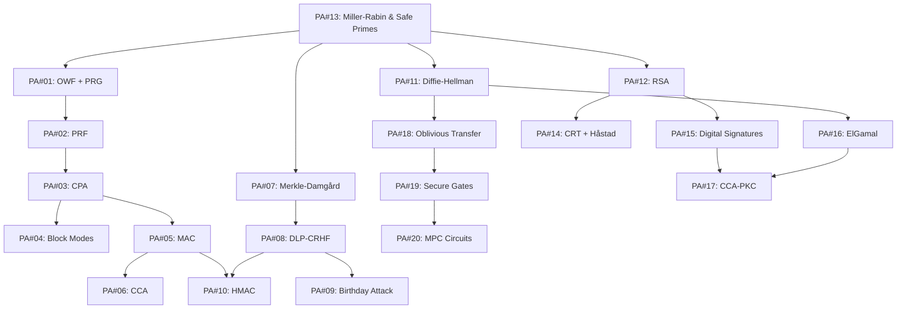
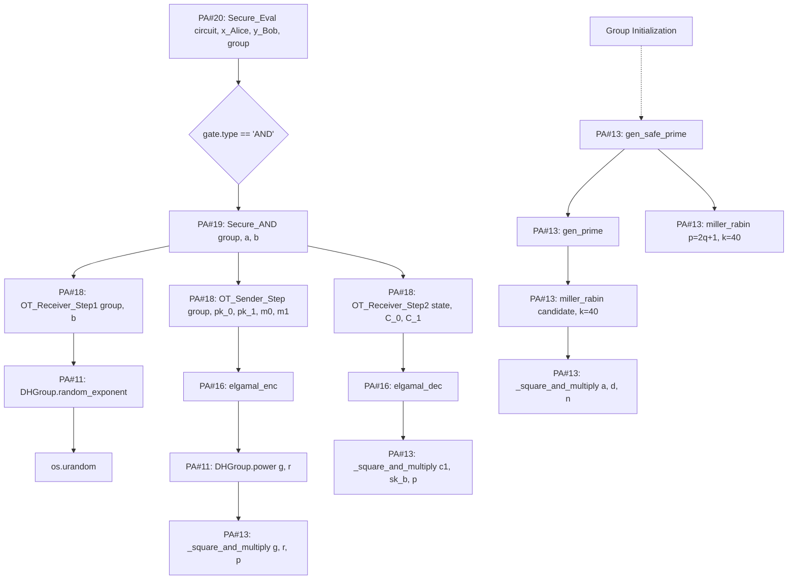

# CryptoStack

    

A full-stack cryptographic engine and interactive educational dashboard. This project features the end-to-end implementation of 20 cryptographic primitives built entirely from first principles, scaling from foundational One-Way Functions up to 2-party Multi-Party Computation (MPC).

Coupled with a FastAPI backend and a custom React dashboard, this project provides a "learning-by-breaking" environment to simulate cryptographic attacks, visualize secure protocols in real-time, and trace full bidirectional reductions.

## 🚀 Core Features

* **Built from Scratch:** All 20 cryptographic primitives are implemented using **only the Python standard library**. The only permitted exceptions are: (1) `int` for arbitrary precision, (2) `os.urandom` for secure randomness, and (3) `pow(a, b, n)` for modular exponentiation.
* **"Learning-by-Breaking" Simulations:** Interactive API endpoints designed to demonstrate exactly why insecure primitives fail, including ECB determinism, CPA nonce reuse, MAC tampering, and DH MITM attacks.
* **Interactive UI Dashboard:** A complete React 18 frontend providing visual representations of Merkle-Damgård chains, Hash outputs, Diffie-Hellman Key Exchanges, and MPC circuits.
* **RESTful API Backend:** A heavily optimized FastAPI backend exposing 50+ endpoints. It utilizes lazy-loaded singletons to cache expensive computational objects (AES PRF, DH groups, RSA keypairs) for instant response times.

---

## 📚 The Cryptographic Stack

The core engine is broken down into 20 distinct modules, structured into five progressive phases.

### Phase 0: Number Theory Foundations

| Module | Topic | Description |
| --- | --- | --- |
| `pa13` | **Miller-Rabin** | Primality testing and secure prime generation (foundation for all PAs) |

### Phase 1: Symmetric Cryptography

| Module | Topic | Description |
| --- | --- | --- |
| `pa01` | **OWF & PRG** | One-Way Functions, HILL construction, and NIST tests |
| `pa02` | **PRF** | GGM binary tree PRF and AES-128 built from scratch |
| `pa03` | **CPA** | IND-CPA secure encryption implementation |
| `pa04` | **Modes** | ECB, CBC, OFB, and CTR block cipher modes |
| `pa05` | **MAC** | PRF-MAC, CBC-MAC, and HMAC implementations |
| `pa06` | **CCA** | Encrypt-then-MAC (CCA-secure) construction |

### Phase 2: Hashing & Hash-Based Constructions

| Module | Topic | Description |
| --- | --- | --- |
| `pa07` | **Merkle-Damgård** | Hash framework construction with MD-strengthening padding |
| `pa08` | **DLP-CRHF** | Discrete Logarithm Problem-based CRHF |
| `pa09` | **Birthday** | Birthday paradox and collision attacks |
| `pa10` | **HMAC** | Full HMAC and Encrypt-then-HMAC construction |

### Phase 3: Public-Key Cryptography

| Module | Topic | Description |
| --- | --- | --- |
| `pa11` | **Diffie-Hellman** | DH key exchange protocols |
| `pa12` | **RSA** | RSA encryption with PKCS#1 v1.5 padding |
| `pa14` | **CRT** | Chinese Remainder Theorem and Håstad's attack |
| `pa15` | **Signatures** | RSA digital signatures |
| `pa16` | **ElGamal** | ElGamal Public-Key Encryption (PKE) |
| `pa17` | **CCA-PKC** | CCA-secure PKC combining ElGamal and RSA signatures |

### Phase 4: Multi-Party Computation

| Module | Topic | Description |
| --- | --- | --- |
| `pa18` | **Oblivious Transfer** | 1-out-of-2 OT protocols |
| `pa19` | **Secure Gates** | Secure AND, XOR, and NOT logic gates |
| `pa20` | **MPC Circuits** | 2-party MPC circuits (comparison, equality, addition) |

---

## 🛠️ Setup & Installation

**Prerequisites:** Python 3.10+ and Node.js 18+ (Node is only required for the web app frontend).

```bash
# Clone the repository
git clone https://github.com/ekansh0301/cryptostack.git
cd cryptostack

# Install API dependencies (FastAPI, Uvicorn, Pydantic)
pip install -r requirements.txt

# Install webapp frontend dependencies
cd webapp
npm install
cd ..
```

---

## 💻 Quick Start

### 1. Run the Test Suite

Execute the comprehensive test suite to validate all 20 cryptographic implementations.

```bash
python tests/test_all.py

```

### 2. Start the Backend API

Launch the FastAPI server (runs locally on port 8000).

```bash
python -m uvicorn backend.api:app --reload --port 8000
```

### 3. Start the React Dashboard

In a new terminal window, spin up the frontend UI.

```bash
cd webapp
npm run dev
# Open http://localhost:5173 in your browser

```

---

## 🛡️ Interactive Security Simulations ("Learning-by-Breaking")

The API includes several specialized endpoints designed to demonstrate exactly why insecure cryptographic primitives fail in the real world.

| Simulation | Endpoint | Technical Demonstration |
| --- | --- | --- |
| **ECB Determinism** | `/pa04/ecb_demo` | Proves that identical plaintext blocks yield identical ciphertext blocks in ECB mode, unlike CBC or CTR. |
| **CPA Nonce Reuse** | `/pa03/cpa_challenge` | Shows how an attacker can distinguish messages if a nonce is reused in CPA-secure encryption. |
| **CCA Bitflip Attack** | `/pa06/bitflip` | Demonstrates that flipping a ciphertext bit in CPA-only mode corrupts the plaintext silently, whereas CCA strictly rejects it. |
| **MAC Tampering** | `/pa05/tamper_test` | Shows how flipping message or tag bits causes immediate MAC verification failure. |
| **DH Man-in-the-Middle** | `/pa11/mitm` | Simulates an adversary intercepting a Diffie-Hellman exchange to establish separate shared keys with Alice and Bob. |
| **RSA Determinism** | `/pa12/determinism` | Compares textbook RSA (identical ciphertexts) against PKCS#1 v1.5 randomized padding. |
| **Signature Forgery** | `/pa15/forgery` | Exploits multiplicative homomorphism to forge a signature without a private key: `σ(m1 * m2) = σ(m1) * σ(m2)`. |
| **ElGamal Malleability** | `/pa16/malleability` | Multiplies the ciphertext by a scalar, showing that decryption yields a scaled plaintext. |
| **CCA-PKC vs ElGamal** | `/pa17/contrast` | Side-by-side contrast proving plain ElGamal is malleable, while CCA-PKC (with RSA signatures) detects and rejects tampering. |

---

## 🌐 Backend API Endpoints

The FastAPI backend exposes over 50 HTTP endpoints. To keep this documentation clean, the API routes are categorized and collapsed below.

| Endpoint | Method | Description |
| --- | --- | --- |
| `/` | GET | Root health status |
| `/health` | GET | API health check |
| `/pa01/owf` | POST | Evaluate DLP-based one-way function `f(x) = g^x mod p` |
| `/pa01/prg` | POST | Generate pseudorandom bits from OWF-PRG (HILL construction) |
| `/pa01/randomness_test` | POST | Run NIST statistical tests on PRG output |
| `/pa02/prf` | POST | Evaluate AES-based PRF: `F(k, x)` |
| `/pa02/ggm_tree` | POST | Build full GGM binary tree and highlight query path |
| `/pa03/encrypt` | POST | CPA-secure encryption |
| `/pa03/decrypt` | POST | CPA-secure decryption |
| `/pa03/cpa_challenge` | POST | IND-CPA indistinguishability game |
| `/pa04/encrypt` | POST | Encrypt with mode (ECB / CBC / OFB / CTR) |
| `/pa04/decrypt` | POST | Decrypt with mode (ECB / CBC / OFB / CTR) |
| `/pa04/ecb_demo` | POST | Demonstrate ECB determinism vulnerability |
| `/pa05/mac` | POST | Compute MAC (PRF-MAC or CBC-MAC) |
| `/pa05/verify` | POST | Verify MAC tag |
| `/pa05/tamper_test` | POST | Demonstrate MAC tampering detection |
| `/pa06/encrypt` | POST | Encrypt-then-MAC (CCA-secure) |
| `/pa06/bitflip` | POST | Compare CPA vs CCA bitflip attack |

| Endpoint | Method | Description |
| --- | --- | --- |
| `/pa07/hash` | POST | Compute Merkle-Damgård toy hash |
| `/pa07/chain` | POST | Visualize full Merkle-Damgård chain with intermediate CVs |
| `/pa08/hash` | POST | DLP-based collision-resistant hash (CRHF) |
| `/pa09/birthday` | POST | Run birthday attack and find hash collisions |
| `/pa09/birthday_curve` | POST | Generate birthday paradox probability curves |
| `/pa10/hmac` | POST | Compute HMAC tag |
| `/pa10/hmac_verify` | POST | Verify HMAC tag |
| `/pa11/dh_exchange` | GET | Run DH exchange (Alice, Bob, shared secret) |
| `/pa11/dh_interactive` | GET | Full DH parameters and group details |
| `/pa11/mitm` | POST | Demonstrate Man-in-the-Middle attack on DH |
| `/pa12/keygen` | GET | Generate new RSA keypair |
| `/pa12/encrypt` | POST | RSA encrypt and decrypt round-trip |
| `/pa12/determinism` | POST | Compare textbook vs PKCS#1 v1.5 randomization |
| `/pa13/is_prime` | POST | Miller-Rabin primality test |
| `/pa13/miller_rabin_rounds` | POST | Miller-Rabin test with per-round trace |
| `/pa13/carmichael_demo` | GET | Test Carmichael numbers (561, 1105, 1729, ...) |
| `/pa14/crt` | POST | Chinese Remainder Theorem solver |
| `/pa14/hastad` | POST | Håstad broadcast attack (RSA with e=3) |
| `/pa15/sign` | POST | RSA digital signature |
| `/pa15/verify` | POST | RSA signature verification (with tampering demo) |
| `/pa15/forgery` | POST | Demonstrate multiplicative forgery on raw RSA |
| `/pa16/encrypt` | POST | ElGamal encryption and decryption |
| `/pa16/malleability` | POST | Demonstrate ElGamal malleability attack |
| `/pa16/malleability_batch` | POST | Run malleability attack across trials |
| `/pa17/encrypt` | POST | CCA-secure PKC (ElGamal + RSA signature) |
| `/pa17/contrast` | POST | Compare plain ElGamal (malleable) vs CCA-PKC (tamper-evident) |

| Endpoint | Method | Description |
| --- | --- | --- |
| `/pa18/ot` | POST | 1-out-of-2 OT protocol: receiver privacy & sender privacy |
| `/pa19/secure_and` | POST | Secure AND gate (via OT + DH) |
| `/pa19/secure_xor` | POST | Secure XOR gate (additive sharing) |
| `/pa19/truth_table` | GET | Truth table for AND, XOR, NOT gates |
| `/pa20/millionaires` | POST | Millionaire's problem (secure comparison circuit) |
| `/pa20/equality` | POST | Secure equality test |
| `/pa20/addition` | POST | Secure binary addition circuit |
| `/reductions/{A}/{B}` | GET | Bidirectional reduction proofs (OWF ↔ PRG, PRG ↔ PRF, etc.) |

---


## 🔗 Bidirectional Reductions

A core focus of this project is proving the mathematical reductions between primitives.

* **OWF → PRG:** Implemented via the HILL construction. For a given seed s, the system iterates a one-way function f repeatedly, extracting the Goldreich-Levin hard-core bit at each step to generate verifiable pseudorandomness.
* **PRG → OWF:** Demonstrates that a PRG is inherently a One-Way Function by defining f_G(s) = G(s). Inverting G to recover the original PRG seed s is mathematically hard by the fundamental definition of PRG security.
* **PRG → PRF:** Utilizes a GGM binary tree. It parses the input x = b₁ b₂ ... bₙ and traverses the tree, applying the pseudorandom generator G_b at each level to evaluate the function securely.
* **PRF → PRG:** Expands randomness by defining G(s) = F_s(0ⁿ) ∥ F_s(1ⁿ). The pseudorandomness of the concatenated output reduces directly to the underlying security of the Pseudorandom Function.
* **CRHF ↔ HMAC ↔ MAC:** Demonstrates a comprehensive bidirectional proof network. This includes utilizing HMAC_k(cv ∥ block) as the compression function within the Merkle-Damgård framework, and formally proving EUF-CMA (Existential Unforgeability under Chosen Message Attack) satisfaction.

---

## 🏗️ Deep Architectural Traces



One `AND` gate evaluation in PA#20 traces through the entire mathematical foundation of the project, all the way down to arbitrary-precision prime generation.



---

## 🖥️ Webapp Architecture

The React dashboard (`webapp/`) acts as the interactive visualizer. It is organized into three specific page modules that handle real-time API calls and registry metadata:

| React Component | Programming Assignments | Topics Covered |
| --- | --- | --- |
| `PA01_06.jsx` | PA#01 - PA#06 | Foundations (OWF, PRG, PRF, GGM) and Symmetric Crypto (CPA, Modes, MAC, CCA) |
| `PA07_12.jsx` | PA#07 - PA#12 | Hashing (Merkle-Damgård, DLP-CRHF, Birthday, HMAC) and Public Key (DH, RSA) |
| `PA13_20.jsx` | PA#13 - PA#20 | Primality, CRT, Signatures, ElGamal, CCA-PKC, OT, Secure Gates, and MPC |

---

## 📜 Implementation Notes & Allowed Exceptions

### Cryptographic Implementations

* **AES-128:** Fully implemented from scratch (including S-box, key schedule, MixColumns, ShiftRows, AddRoundKey, and inverses). Verified against NIST KAT vectors.
* **Miller-Rabin:** Utilizes 40 rounds and correctly identifies all tested Carmichael numbers (e.g., 561, 1105, 1729).
* **Oblivious Transfer (OT):** Receiver privacy ensures `pk_{1-b}` is a random group element with no known dlog. Sender privacy ensures the receiver cannot decrypt `C_{1-b}` without `sk_{1-b}`.
* **MPC Circuits:** Implemented as a topologically ordered DAG. AND gates use OT (PA#18), XOR uses additive sharing, and NOT is resolved locally.

### Allowed Library Exceptions (Per Specification)

To strictly adhere to the project spec, the following standard libraries are the **only** exceptions utilized to build the primitives:

1. `int` : Python's arbitrary-precision integers.
2. `os.urandom` : Used strictly for cryptographically secure randomness.
3. `pow(a, b, n)` : Python's built-in modular exponentiation.
4. Additional standard library modules for non-cryptographic operations: `struct` (binary packing), `math` (NIST tests), `time` (benchmarking), `threading` (API management).

Note: A custom `_square_and_multiply` function is also implemented in PA#13 for demonstration and educational benchmarking purposes, but the built-in `pow` is used in production code.